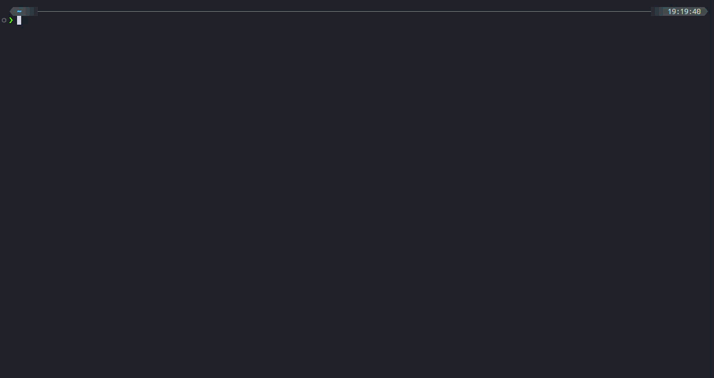

# ecs-exec


`aws ecs execute-command` の対話型ラッパー。クラスタ・サービス・タスク・コンテナ・シェルを順に選択して接続する。

## 必要なもの

- AWS CLI v2
- jq
- fzf（任意 — なければ番号選択にフォールバック）

## 使い方

```bash
ecs_exec <aws-profile>
```

実行すると以下の順で対話的に選択できる:

1. クラスタ
2. サービス
3. タスク（RUNNING のみ）
4. コンテナ

選択肢が1つしかない場合は自動で確定する。シェルはデフォルトで `sh` で接続する（bash 非搭載コンテナでのタイムアウト回避のため）。bash を使いたい場合は環境変数で切替:

```bash
ECS_EXEC_SHELL=bash ecs_exec <aws-profile>
```

## ECS Exec が無効な場合の代替（CloudShell VPC）

サービスの `enableExecuteCommand=false` を検知した場合、以下を提示する:

1. **CloudShell VPC でネットワーク調査** — 対象タスクと同一の VPC / サブネット / セキュリティグループを表示し、CloudShell のコンソールを開く
2. このまま ECS Exec を試す（失敗する可能性あり）
3. 中止

CloudShell VPC を選択すると、作成に必要な以下の情報が表示され、URL が自動でブラウザ / クリップボードに送られる:

- リージョン
- VPC ID
- サブネット ID（選択したタスクのサブネット）
- セキュリティグループ（タスクの ENI に紐づくもの）

CloudShell 側で左上 `[+] > Create VPC environment` を選び、上記を入力するだけで同一ネットワークからの疎通調査が可能。

> CloudShell VPC はコンソール専用機能のため、環境作成の最終ステップだけはブラウザでの操作になる（[AWS CloudShell FAQs](https://aws.amazon.com/cloudshell/faqs/)）。VPC 内 CloudShell からインターネット / AWS API へ出るには NAT GW もしくは VPC エンドポイントが必要。

## 前提条件

- 対象タスクで ECS Exec が有効化されていること（`enableExecuteCommand: true`） — 無効時は CloudShell VPC フォールバックを利用
- Session Manager Plugin がインストール済みであること
- 後述の IAM ポリシーが付与されていること（実行者・タスクロール両方）

## IAM ポリシー

<details>
<summary><b>1. 実行者 (ecs_exec を実行するユーザー / ロール) 用</b></summary>

通常の接続のみであれば `EcsExecBase` のみで動作する。CloudShell VPC フォールバックを使う場合は `CloudShellVpcDiscovery` と `CloudShell` も付与する。

```json
{
  "Version": "2012-10-17",
  "Statement": [
    {
      "Sid": "EcsExecBase",
      "Effect": "Allow",
      "Action": [
        "sts:GetCallerIdentity",
        "ecs:ListClusters",
        "ecs:ListServices",
        "ecs:DescribeServices",
        "ecs:ListTasks",
        "ecs:DescribeTasks",
        "ecs:DescribeTaskDefinition",
        "ecs:ExecuteCommand"
      ],
      "Resource": "*"
    },
    {
      "Sid": "CloudShellVpcDiscovery",
      "Effect": "Allow",
      "Action": [
        "ec2:DescribeNetworkInterfaces"
      ],
      "Resource": "*"
    },
    {
      "Sid": "CloudShell",
      "Effect": "Allow",
      "Action": [
        "cloudshell:*"
      ],
      "Resource": "*"
    }
  ]
}
```

</details>

<details>
<summary><b>2. タスクロール側 (接続先コンテナ) 用</b></summary>

ECS Exec で接続するコンテナのタスクロールには SSM メッセージング権限が必要です。

```json
{
  "Version": "2012-10-17",
  "Statement": [
    {
      "Effect": "Allow",
      "Action": [
        "ssmmessages:CreateControlChannel",
        "ssmmessages:CreateDataChannel",
        "ssmmessages:OpenControlChannel",
        "ssmmessages:OpenDataChannel"
      ],
      "Resource": "*"
    }
  ]
}
```

</details>
